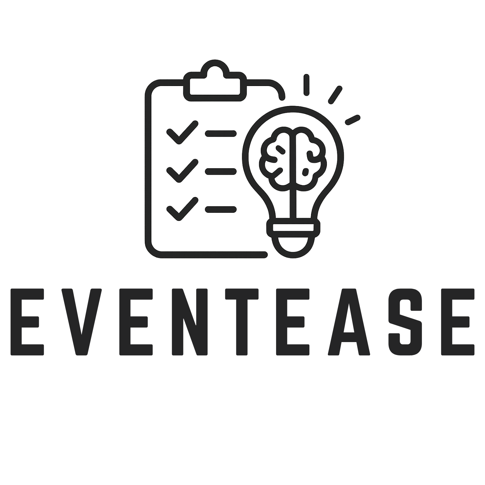

# <!-- Improved compatibility of back to top link: See: https://github.com/othneildrew/Best-README-Template/pull/73 -->
<a id="readme-top"></a>


<!-- PROJECT LOGO -->
<br />
<div align="center">
  <a href="https://github.com/samnguyen3115/eventease">
    
  </a>

<h3 align="center">EventEase</h3>

  <p align="center">
    An intelligent event management and task orchestration platform powered by AI
    <br />
    <br />
    <a href="https://github.com/samnguyen3115/eventease/issues/new?labels=bug&template=bug-report---.md">Report Bug</a>
    ·
    <a href="https://github.com/samnguyen3115/eventease/issues/new?labels=enhancement&template=feature-request---.md">Request Feature</a>
  </p>
</div>

<!-- TABLE OF CONTENTS -->
<details>
  <summary>Table of Contents</summary>
  <ol>
    <li>
      <a href="#about-the-project">About The Project</a>
      <ul>
        <li><a href="#built-with">Built With</a></li>
      </ul>
    </li>
    <li>
      <a href="#getting-started">Getting Started</a>
      <ul>
        <li><a href="#prerequisites">Prerequisites</a></li>
        <li><a href="#installation">Installation</a></li>
      </ul>
    </li>
    <li><a href="#usage">Usage</a></li>
    <li><a href="#features">Features</a></li>
    <li><a href="#roadmap">Roadmap</a></li>
    <li><a href="#contributing">Contributing</a></li>
    <li><a href="#license">License</a></li>
    <li><a href="#contact">Contact</a></li>
    <li><a href="#acknowledgments">Acknowledgments</a></li>
  </ol>
</details>

<!-- ABOUT THE PROJECT -->
## About The Project

[![EventEase Screenshot][product-screenshot]](https://github.com/samnguyen3115/eventease)

EventEase is a comprehensive event management platform that leverages artificial intelligence to streamline event planning and task management. Built with Flask and powered by Google's Gemini AI, it offers intelligent task generation, collaborative planning, and advanced verification systems for professional event coordination.

The platform addresses the complexity of modern event planning by providing:
* **AI-Powered Task Generation** - Intelligent creation of contextual task lists based on event requirements
* **Collaborative Workflows** - Multi-user planning with real-time synchronization and role-based access
* **Quality Assurance Systems** - Optional image verification for critical task completion
* **Enterprise Integration** - Calendar export, email notifications, and multi-language support

EventEase transforms traditional event planning into an intelligent, collaborative, and efficient process suitable for both personal and professional use cases.

<p align="right">(<a href="#readme-top">back to top</a>)</p>

### Built With

* [![Flask][Flask.py]][Flask-url]
* [![Python][Python.py]][Python-url]
* [![SQLAlchemy][SQLAlchemy.py]][SQLAlchemy-url]
* [![Bootstrap][Bootstrap.com]][Bootstrap-url]
* [![Google AI][GoogleAI.com]][GoogleAI-url]
* [![Jinja2][Jinja2.py]][Jinja2-url]
* [![PostgreSQL][PostgreSQL.com]][PostgreSQL-url]

<p align="right">(<a href="#readme-top">back to top</a>)</p>

<!-- GETTING STARTED -->
## Getting Started

To get EventEase running locally, follow these steps to set up your development environment.

### Prerequisites

Ensure you have the following installed on your system:

* Python 3.8 or higher
  ```sh
  python --version
  ```
* pip (Python package installer)
  ```sh
  pip --version
  ```
* Git
  ```sh
  git --version
  ```

### Installation

1. **Obtain Google Gemini API Key**
   - Visit [Google AI Studio](https://makersuite.google.com/app/apikey)
   - Create a new API key for Gemini AI

2. **Clone the repository**
   ```sh
   git clone https://github.com/samnguyen3115/eventease.git
   ```

3. **Navigate to project directory**
   ```sh
   cd eventease
   ```

4. **Create virtual environment**
   ```sh
   python -m venv .venv
   ```

5. **Activate virtual environment**
   ```sh
   # Windows
   .venv\Scripts\activate
   
   # macOS/Linux
   source .venv/bin/activate
   ```

6. **Install dependencies**
   ```sh
   pip install -r requirements.txt
   ```

7. **Create environment configuration**
   ```sh
   # Create .env file in root directory
   touch .env
   ```

8. **Configure environment variables** in `.env`:
   ```env
   SECRET_KEY=your-secret-key-here
   GEMINI_API_KEY=your-gemini-api-key
   DATABASE_URL=sqlite:///eventease.db
   MAIL_SERVER=smtp.gmail.com
   MAIL_PORT=587
   MAIL_USERNAME=your-email@example.com
   MAIL_PASSWORD=your-app-password
   FLASK_DEBUG=1
   FLASK_PORT=5000
   ```

9. **Initialize database**
   ```sh
   flask db init
   flask db migrate -m "Initial migration"
   flask db upgrade
   ```

10. **Start the application**
    ```sh
    python eventease.py
    ```

<p align="right">(<a href="#readme-top">back to top</a>)</p>

<!-- USAGE EXAMPLES -->
## Usage

EventEase provides multiple interfaces for event management and task coordination:

### Core Workflows

**Event Creation with AI Assistant**
```
1. Navigate to the chatbot interface
2. Describe your event in natural language
3. Let AI generate contextual task lists
4. Review and customize generated tasks
5. Invite collaborators to join
```

**Task Management**
```
1. Access event dashboard
2. Monitor progress with visual indicators
3. Assign tasks to team members
4. Enable strict mode for verification
5. Export to external calendars
```

**Collaborative Planning**
```
1. Add friends through email invitations
2. Share events with selected collaborators
3. Assign responsibilities and deadlines
4. Track collective progress
5. Receive automated notifications
```

<!-- FEATURES -->
## Features

### Core Capabilities
- **Intelligent Event Creation**: AI-powered task generation based on event context
- **Real-time Collaboration**: Multi-user planning with live synchronization
- **Progress Analytics**: Visual tracking with comprehensive dashboards
- **Quality Assurance**: Optional image verification for task completion

### AI Integration
- **Conversational Interface**: Natural language event planning with Google Gemini
- **Voice Assistant**: Hands-free event creation and management
- **Computer Vision**: Automated task verification through image analysis
- **Smart Recommendations**: Context-aware suggestions for optimal planning

### Enterprise Features
- **Calendar Integration**: Standards-compliant ICS export
- **Email Automation**: User verification and notification systems
- **Multi-language Support**: Translation capabilities for global teams
- **Access Control**: Role-based permissions and collaboration management

### Technical Capabilities
- **Responsive Design**: Cross-device compatibility with Bootstrap 5
- **Database Flexibility**: SQLite for development, PostgreSQL for production
- **Security**: bcrypt password hashing and session management
- **Testing Suite**: Comprehensive unit, integration, and end-to-end testing

<p align="right">(<a href="#readme-top">back to top</a>)</p>

<!-- ROADMAP -->
## Roadmap

### Completed Features
- [x] **Core event management system** - Complete event lifecycle management
- [x] **AI-powered task generation** - Intelligent task creation with Gemini AI
- [x] **Image verification system** - Computer vision task validation
- [x] **Calendar export functionality** - ICS format calendar integration

### In Development
- [ ] **Mobile application development** - iOS and Android native apps
- [ ] **Advanced analytics dashboard** - Real-time insights and reporting

### Planned Features
- [ ] **Third-party integrations** - Slack, Microsoft Teams connectivity
- [ ] **API documentation and SDK** - Developer tools and resources
    - [ ] REST API specification
    - [ ] Python SDK
    - [ ] JavaScript SDK

See the [open issues](https://github.com/samnguyen3115/eventease/issues) for a full list of proposed features and known issues.

<p align="right">(<a href="#readme-top">back to top</a>)</p>

<!-- CONTRIBUTING -->
## Contributing

Contributions are what make the open source community such an amazing place to learn, inspire, and create. Any contributions you make are **greatly appreciated**.

If you have a suggestion that would make this better, please fork the repo and create a pull request. You can also simply open an issue with the tag "enhancement".
Don't forget to give the project a star! Thanks again!

### Development Guidelines

1. **Code Standards**: Follow PEP 8 for Python code formatting
2. **Testing**: Maintain minimum 80% test coverage
3. **Documentation**: Include comprehensive docstrings
4. **Commits**: Use conventional commit messages

### Contribution Process

1. Fork the Project
2. Create your Feature Branch (`git checkout -b feature/AmazingFeature`)
3. Commit your Changes (`git commit -m 'Add some AmazingFeature'`)
4. Push to the Branch (`git push origin feature/AmazingFeature`)
5. Open a Pull Request

<p align="right">(<a href="#readme-top">back to top</a>)</p>

<!-- LICENSE -->
## License

Distributed under the MIT License. See `LICENSE.txt` for more information.

<p align="right">(<a href="#readme-top">back to top</a>)</p>

<!-- CONTACT -->
## Contact

Tran Minh Duc Nguyen - [@samnguyen3115](https://github.com/samnguyen3115) - ducsam.work@gmail.com

Project Link: [https://github.com/samnguyen3115/eventease](https://github.com/samnguyen3115/eventease)

<p align="right">(<a href="#readme-top">back to top</a>)</p>

<!-- ACKNOWLEDGMENTS -->
## Acknowledgments

* [Google AI Platform](https://ai.google.dev/) - Gemini AI for intelligent conversation capabilities
* [Salesforce Research](https://github.com/salesforce/BLIP) - BLIP model for computer vision integration
* [Flask Development Team](https://flask.palletsprojects.com/) - Comprehensive web framework
* [Bootstrap Team](https://getbootstrap.com/) - Responsive design framework
* [Best README Template](https://github.com/othneildrew/Best-README-Template) - README template structure

<p align="right">(<a href="#readme-top">back to top</a>)</p>

<!-- MARKDOWN LINKS & IMAGES -->
[contributors-shield]: https://img.shields.io/github/contributors/samnguyen3115/eventease.svg?style=for-the-badge
[contributors-url]: https://github.com/samnguyen3115/eventease/graphs/contributors
[forks-shield]: https://img.shields.io/github/forks/samnguyen3115/eventease.svg?style=for-the-badge
[forks-url]: https://github.com/samnguyen3115/eventease/network/members
[stars-shield]: https://img.shields.io/github/stars/samnguyen3115/eventease.svg?style=for-the-badge
[stars-url]: https://github.com/samnguyen3115/eventease/stargazers
[issues-shield]: https://img.shields.io/github/issues/samnguyen3115/eventease.svg?style=for-the-badge
[issues-url]: https://github.com/samnguyen3115/eventease/issues
[license-shield]: https://img.shields.io/github/license/samnguyen3115/eventease.svg?style=for-the-badge
[license-url]: https://github.com/samnguyen3115/eventease/blob/master/LICENSE.txt
[linkedin-shield]: https://img.shields.io/badge/-LinkedIn-black.svg?style=for-the-badge&logo=linkedin&colorB=555
[linkedin-url]: https://linkedin.com/in/your-linkedin
[product-screenshot]: src/static/img/eventease_screenshot.png
[Flask.py]: https://img.shields.io/badge/Flask-000000?style=for-the-badge&logo=flask&logoColor=white
[Flask-url]: https://flask.palletsprojects.com/
[Python.py]: https://img.shields.io/badge/Python-3776AB?style=for-the-badge&logo=python&logoColor=white
[Python-url]: https://python.org/
[SQLAlchemy.py]: https://img.shields.io/badge/SQLAlchemy-D71F00?style=for-the-badge&logo=sqlalchemy&logoColor=white
[SQLAlchemy-url]: https://sqlalchemy.org/
[Bootstrap.com]: https://img.shields.io/badge/Bootstrap-563D7C?style=for-the-badge&logo=bootstrap&logoColor=white
[Bootstrap-url]: https://getbootstrap.com
[GoogleAI.com]: https://img.shields.io/badge/Google_AI-4285F4?style=for-the-badge&logo=google&logoColor=white
[GoogleAI-url]: https://ai.google.dev/
[Jinja2.py]: https://img.shields.io/badge/Jinja2-B41717?style=for-the-badge&logo=jinja&logoColor=white
[Jinja2-url]: https://jinja.palletsprojects.com/
[PostgreSQL.com]: https://img.shields.io/badge/PostgreSQL-316192?style=for-the-badge&logo=postgresql&logoColor=white
[PostgreSQL-url]: https://postgresql.org/
